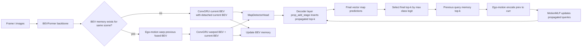

# Phase 0.5: StreamMapNet Query Propagation Static Analysis

Date: 2026-05-21

Scope: static source-code analysis only. No environment setup, checkpoint loading, dataset download, or model inference was performed.

Companion hook plan: see `phase_0_5_instrumentation_plan.md` for the implemented default-off debug hooks, reset hooks, and reliable propagated-query mask.

Repository snapshot:

- Remote: `https://github.com/yuantianyuan01/StreamMapNet.git`
- HEAD: `000ce22f2fae6a1798a57471f820b8232ae76a74`
- Main NuScenes config: `plugin/configs/nusc_newsplit_480_60x30_24e.py`
- Official NuScenes newsplit 60m x 30m AP target from README: AP 34.1, AP_ped 32.2, AP_div 29.3, AP_bound 40.8

## Executive Conclusion

H1 prior: medium.

The static code path supports a plausible temporal residue mechanism. A wrong boundary query can be propagated from frame `t` to `t+1` if it is among the final top-k classification-logit queries at frame `t`. There is no absolute confidence hard threshold in the query memory update path. However, propagation is competitive top-k selection, so a low-confidence wrong query is dropped if at least `topk` other queries score higher.

Residue source prior: query propagation medium, BEV fusion medium-to-high.

Query propagation has a discrete bottleneck of top-k candidates. BEV fusion has no confidence filtering and carries a recurrent ConvGRU-fused feature map every frame, so attack residue can survive through BEV memory even when the wrong instance query does not enter top-k. For Phase 1, reset-query-only and reset-BEV-only ablations are both necessary.

Phase 1 recommendation: continue, but instrument before full experiments.

The kill condition is not met by static analysis: low-confidence queries are not removed by a hard threshold, and BEV memory is not obviously weak. The next step should be a small clean/attack probe once the server is free, with hooks that log top-k query IDs/scores, propagated geometry, and BEV reset ablations.

## Temporal Pipeline



## Source Findings

### Query memory state

The query temporal state is implemented in `MapDetectorHead`:

- `query_memory`: saved query embeddings.
- `reference_points_memory`: saved vector reference points.
- `target_memory`: training-only GT targets for transition loss.
- `query_update`: `MotionMLP(c_dim=12, f_dim=embed_dims, identity=True)`.

Relevant code:

- `plugin/models/heads/MapDetectorHead.py:54-71`
- `plugin/models/utils/query_update.py:6-33`

### Candidate selection logic

Propagation candidates are selected after the final decoder layer by:

```python
_scores, _ = _scores.max(-1)
topk_score, topk_idx = _scores.topk(k=self.topk_query, dim=-1)
```

This happens in both train and test:

- Train: `plugin/models/heads/MapDetectorHead.py:391-404`
- Test: `plugin/models/heads/MapDetectorHead.py:499-509`

Config values for NuScenes 60m x 30m:

- `num_queries = 100`
- `topk = int(num_queries * (1/3)) = 33`
- `prop_add_stage = 1`

Relevant config:

- `plugin/configs/nusc_newsplit_480_60x30_24e.py:140-170`

Interpretation:

- Candidate selection is hard top-k ranking.
- It is not an absolute confidence threshold.
- It uses raw max class logits, not sigmoid probabilities.
- `score_thr=0.1` in the head constructor is not used in propagation.

### How previous-frame queries enter the next frame

At the start of frame `t+1`, `propagate()` loads query and reference-point memory. If the scene is not new, it computes `prev2curr_matrix` from stored and current ego poses, feeds a 12D pose encoding into `MotionMLP`, and transforms previous reference points into the current ego frame.

Relevant code:

- Query load: `plugin/models/heads/MapDetectorHead.py:198-209`
- Ego-motion matrix: `plugin/models/heads/MapDetectorHead.py:220-235`
- Query update: `plugin/models/heads/MapDetectorHead.py:237-242`
- Reference point transform: `plugin/models/heads/MapDetectorHead.py:268-283`

The propagated queries are inserted into the decoder at `prop_add_stage`. For non-first frames, the decoder concatenates all propagated top-k queries with the best `num_queries - topk` current-frame queries.

Relevant code:

- `plugin/models/transformer_utils/MapTransformer.py:96-115`

For NuScenes 60m x 30m, this means 33 propagated queries plus 67 current queries at decoder layer 1.

### Confidence filtering: hard threshold or soft weighting?

The propagation memory update is top-k hard selection, not soft weighting and not absolute-threshold filtering.

Important nuance:

- A low-confidence wrong query can still enter `t+1` if it ranks in the top 33 at frame `t`.
- A low-confidence wrong query will be dropped if 33 other queries have higher max class logits.
- There is no code path like `score > threshold` before updating `query_memory`.

Post-processing uses `thr=0.0` by default and sigmoid scores for exported predictions, but this is after model inference and does not control query memory.

Relevant code:

- Query memory top-k: `plugin/models/heads/MapDetectorHead.py:499-509`
- Post-process threshold: `plugin/models/heads/MapDetectorHead.py:767-793`

### BEV memory and ego-motion compensation

BEV temporal state is implemented in `StreamMapNet.update_bev_feature()`.

The model stores the fused BEV feature map in `bev_memory`. On the next frame, it:

1. Loads the previous fused BEV and pose metadata.
2. Computes a current-to-previous transform using ego poses.
3. Uses `F.grid_sample()` to warp previous BEV into current alignment.
4. Fuses warped history and current BEV with `ConvGRU`.
5. Detaches and stores the fused result as the next memory.

Relevant code:

- Memory load and first-frame check: `plugin/models/mapers/StreamMapNet.py:106-113`
- Ego-motion compensation: `plugin/models/mapers/StreamMapNet.py:117-139`
- ConvGRU fusion and memory update: `plugin/models/mapers/StreamMapNet.py:140-145`
- ConvGRU equation: `plugin/models/necks/gru.py:27-40`

Interpretation:

- BEV memory is recurrent and confidence-agnostic.
- The historical contribution is learned through ConvGRU gate `z`.
- Static code cannot determine the learned magnitude of historical BEV contribution; this requires logging or ablation.

### Scene initialization

Temporal memory is reset when no previous metadata exists or when `scene_name` changes.

Relevant code:

- Generic memory reset: `plugin/models/utils/memory_buffer.py:39-67`
- Dataset provides `scene_name`: `plugin/datasets/nusc_dataset.py:91-105`

First-frame behavior:

- Query path: propagated slots are zero-padded, but the decoder does not insert them for first frames.
- BEV path: `ConvGRU(curr_bev_feats.detach(), curr_bev_feats)` is used, so there is no previous-scene feature leakage.

## Required Questions Answered

### Does the previous-frame query enter the next frame?

Yes. The previous final top-k query embeddings and reference points are saved in memory, ego-motion transformed or updated, then injected into the next frame decoder at `prop_add_stage=1`.

### How is BEV memory fused?

The previous fused BEV is ego-motion warped into the current frame and fused with current BEV by `ConvGRU`. The fused output is detached and stored as the next BEV memory.

### Is temporal state filtered by confidence?

Query state is filtered by ranking only: final top-k max class logits. There is no absolute confidence threshold in the query memory update. BEV state is not confidence-filtered.

### How is state initialized at the start of a scene?

`StreamTensorMemory.get()` resets memory when `scene_name` changes or memory is empty. Query propagation is disabled for first frames; BEV uses current BEV as the pseudo-history input to ConvGRU.

### If an erroneous query has low confidence, can it enter `t+1`?

Yes, but only if it is still in the top 33 by max class logit for the frame. If it falls below rank 33, it is not stored in query memory.

### Is residue more likely from query propagation or BEV fusion?

Static prior is mixed. Query propagation is a strong but top-k-gated discrete channel. BEV fusion is a continuous recurrent channel with no confidence gate, so it may be the more reliable residue source if attack effects are spatially diffuse or if wrong boundary queries have weak classification logits.

### Is Phase 1 worth running?

Yes. The source code does not satisfy the kill condition. A transient attack has at least two plausible temporal paths: top-k query memory and recurrent BEV memory.

## Notes for TODO 1 Without Running

Can be completed now:

- Identify official NuScenes clean target: newsplit 60m x 30m AP 34.1 from README.
- Identify official config: `plugin/configs/nusc_newsplit_480_60x30_24e.py`.
- Identify official checkpoint link in README.
- Identify clean inference entry point: `tools/test.py` or `tools/dist_test.sh`.
- Identify vector export path: `dataset.evaluate()` calls `format_results()`, which writes `submission_vector.json`.

Cannot be completed until server/dataset/checkpoint are available:

- Clean inference.
- Official clean mAP reproduction.
- CUDA/PyTorch runtime version confirmation.
- Visualization samples generated from actual predictions.

Recommended clean command later:

```bash
python tools/test.py plugin/configs/nusc_newsplit_480_60x30_24e.py /path/to/checkpoint.pth --eval --work-dir work_dirs/nusc_newsplit_480_60x30_24e_clean
```

Expected vector export:

- `work_dirs/nusc_newsplit_480_60x30_24e_clean/submission_vector.json`

## Instrumentation Needed Before Phase 1

Add temporary hooks or debug dumps for:

- Final top-k indices, raw logits, sigmoid scores, labels, and vectors before `query_memory.update()`.
- Propagated query mask after decoder insertion.
- Per-frame memory reset events from `StreamTensorMemory.get()`.
- Optional reset modes: reset-query-only, reset-BEV-only, reset-all.
- ConvGRU gate statistics, especially mean/percentiles of `z`, to estimate BEV historical contribution.

Potential issue to inspect before relying on exported `prop_mask`:

- In `forward_test()`, `prop_mask` is initialized with length equal to the final output query count, then `prop_mask[-self.num_queries:] = False`. Because final output length is also `self.num_queries`, this appears to mark all outputs as non-propagated. The model's internal propagation still occurs, but exported `prop_mask` may not be reliable without a small patch or hook.
